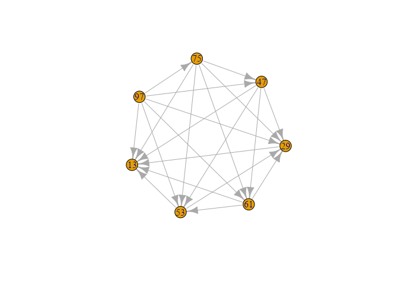
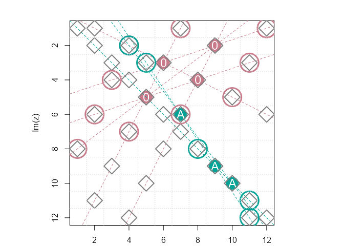
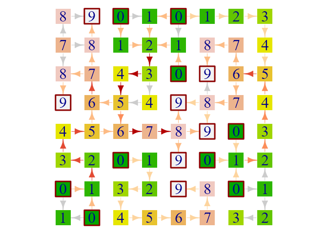

## Day 1: Historian Hysteria

<https://adventofcode.com/2024/day/1>

``` r
source("aoc.R")

test_in <- 
"3   4
4   3
2   5
1   3
3   9
3   3"

(parsed_lists <- aoc_table(test_in, col.names = c("a", "b")))
#>   a b
#> 1 3 4
#> 2 4 3
#> 3 2 5
#> 4 1 3
#> 5 3 9
#> 6 3 3
str(parsed_lists)
#> 'data.frame':    6 obs. of  2 variables:
#>  $ a: int  3 4 2 1 3 3
#>  $ b: int  4 3 5 3 9 3
```

#### part1: diff of ordered list summed

``` r
# Ex: 11
parsed_lists |> 
  with(sort(a) - sort(b)) |> 
  abs() |> 
  sum() 
#> [1] 11

# Same with lapply() & do.call():
parsed_lists |> 
  lapply(sort) |> 
  do.call(what = `-`) |> 
  abs() |> 
  sum()
#> [1] 11
```

#### part2: similarity score

Multiply each `a` with its count in `b`, sum

``` r
# Ex: 31
parsed_lists |> 
  with(table(b)[as.character(a)] * a) |> 
  sum(na.rm = TRUE)
#> [1] 31
```
## Day 2: Red-Nosed Reports

<https://adventofcode.com/2024/day/2>

``` r
source("aoc.R")

test_in <- 
"7 6 4 2 1
1 2 7 8 9
9 7 6 2 1
1 3 2 4 5
8 6 4 4 1
1 3 6 7 9"

parsed_reports <- 
  aoc_lines(test_in) |> 
  strsplit(" ") |> 
  lapply(as.integer)
  
str(parsed_reports)
#> List of 6
#>  $ : int [1:5] 7 6 4 2 1
#>  $ : int [1:5] 1 2 7 8 9
#>  $ : int [1:5] 9 7 6 2 1
#>  $ : int [1:5] 1 3 2 4 5
#>  $ : int [1:5] 8 6 4 4 1
#>  $ : int [1:5] 1 3 6 7 9
```

#### part1: count strictly monotonic level sequences where step is at most 3

``` r
# Ex: 2
diff_within_tol <- \(x) all(abs(x) <= 3) 

diff_is_strictly_monotonic  <- function(x){
  signs <- sign(x) |> unique() 
  length(signs) == 1 && signs[1] != 0
} 

parsed_reports |> 
  lapply(diff) |> 
  sapply(\(x) diff_within_tol(x) && diff_is_strictly_monotonic(x)) |> 
  sum()
#> [1] 2
```

#### part2: tolerate a single bad level

``` r
# Ex: 4
parsed_reports |> 
  sapply(
    \(row) sapply(
      seq_along(row), \(idx) {
        dd <- diff(row[-idx])
        diff_within_tol(dd) && diff_is_strictly_monotonic(dd)
      } 
    ) |> any()
  ) |> sum()
#> [1] 4
```
## Day 3: Mull It Over

<https://adventofcode.com/2024/day/3>

``` r
source("aoc.R")

corrupted_mem_1 <- aoc_lines("xmul(2,4)%&mul[3,7]!@^do_not_mul(5,5)+mul(32,64]then(mul(11,8)mul(8,5))")
corrupted_mem_2 <- aoc_lines("xmul(2,4)&mul[3,7]!^don't()_mul(5,5)+mul(32,64](mul(11,8)undo()?mul(8,5))")
```

#### part1: add up real `mul()` instructions

``` r
# Ex: 161
corrupted_mem_1 |> 
  lapply(\(line) regmatches(line, gregexpr("(?<=mul\\()\\d+,\\d+(?=\\))", line, perl = TRUE))[[1]]) |> 
  unlist() |> 
  strsplit(",") |> 
  do.call(what = rbind) |> 
  `class<-`("numeric") |> 
  print() |> 
  apply(1, prod) |> 
  sum()
#>      [,1] [,2]
#> [1,]    2    4
#> [2,]    5    5
#> [3,]   11    8
#> [4,]    8    5
#> [1] 161
```

#### part2: handle `do()` & `don't()` instructions

Find locations for `do()` & `don't()` matches,
split input text index range by `do`/`don't` intervals,
keep only `do` ranges by checking first values in splits against `dos`;
return only matches where start value is within do_ranges.

``` r
# Ex: 48
do_matches <- function(x){
  dos <- c(1, gregexpr("do\\(\\)", x, perl = TRUE)[[1]])
  donts <- gregexpr("don't\\(\\)", x, perl = TRUE)[[1]]
  dd_splits <- split(1:nchar(x), findInterval(1:nchar(x), sort(c(dos, donts)))) 
  do_ranges <- dd_splits[sapply(dd_splits, `[`, 1) %in% dos] |> do.call(what = c)
  
  matches <- gregexpr("(?<=mul\\()\\d+,\\d+(?=\\))", x, perl = TRUE)
  regmatches(x, matches)[[1]][matches[[1]] %in% do_ranges]
}

corrupted_mem_2 |> 
  paste0(collapse = "") |> 
  do_matches() |> 
  strsplit(",") |> 
  do.call(what = rbind) |> 
  `class<-`("numeric") |> 
  print() |> 
  apply(1, prod) |> 
  sum()
#>      [,1] [,2]
#> [1,]    2    4
#> [2,]    8    5
#> [1] 48
```
## Day 4: Ceres Search

<https://adventofcode.com/2024/day/4>

``` r
source("aoc.R")

test_in <- 
"MMMSXXMASM
MSAMXMSMSA
AMXSXMAAMM
MSAMASMSMX
XMASAMXAMM
XXAMMXXAMA
SMSMSASXSS
SAXAMASAAA
MAMMMXMMMM
MXMXAXMASX"

m <- 
  aoc_lines(test_in) |>
  strsplit("") |> 
  do.call(what = rbind)
m
#>       [,1] [,2] [,3] [,4] [,5] [,6] [,7] [,8] [,9] [,10]
#>  [1,] "M"  "M"  "M"  "S"  "X"  "X"  "M"  "A"  "S"  "M"  
#>  [2,] "M"  "S"  "A"  "M"  "X"  "M"  "S"  "M"  "S"  "A"  
#>  [3,] "A"  "M"  "X"  "S"  "X"  "M"  "A"  "A"  "M"  "M"  
#>  [4,] "M"  "S"  "A"  "M"  "A"  "S"  "M"  "S"  "M"  "X"  
#>  [5,] "X"  "M"  "A"  "S"  "A"  "M"  "X"  "A"  "M"  "M"  
#>  [6,] "X"  "X"  "A"  "M"  "M"  "X"  "X"  "A"  "M"  "A"  
#>  [7,] "S"  "M"  "S"  "M"  "S"  "A"  "S"  "X"  "S"  "S"  
#>  [8,] "S"  "A"  "X"  "A"  "M"  "A"  "S"  "A"  "A"  "A"  
#>  [9,] "M"  "A"  "M"  "M"  "M"  "X"  "M"  "M"  "M"  "M"  
#> [10,] "M"  "X"  "M"  "X"  "A"  "X"  "M"  "A"  "S"  "X"
```

#### part1: count occurrences of “XMAS” – horizontal, vertical, diagonal, also written backwards

- generate a list of array indices for left-to-right and diagonals (main diag. + parallel to main)
- extract strings through array indices, count “XMAS” occurrences
- rotate matrix 3x, extracting and counting in every cycle

``` r
# Ex: 18

# Generate a list of array indices to subset rows, main diagonal and its parallels from a matrix
# @param sqr_m_dim Square matrix dimension (row or column count)
# @param min_diag_length minimum diagonal length, > 1 excludes corners
# @returns List of array indices
make_arrind_lst <- function(sqr_m_dim, min_diag_length = 1){
  m_seq <- 1:sqr_m_dim

  # parallel to diag, lower triangle
  diag_lower_tri <- 
    lapply(
      1:(sqr_m_dim - min_diag_length), 
      \(x) cbind(row = tail(m_seq, -x), col = head(m_seq, -x))
    )
  # upper triangle
  diag_upper_tri <- lapply(diag_lower_tri, \(arr_ind) arr_ind[,2:1])
  
  c(
    # rows, left to right
    row = expand.grid(row = 1:sqr_m_dim, col = 1:sqr_m_dim) |> 
      split(1:sqr_m_dim) |> 
      lapply(as.matrix),
    lo = rev(diag_lower_tri),
    # main diagonal
    diag = list(cbind(row = 1:sqr_m_dim, col = 1:sqr_m_dim)), 
    up = diag_upper_tri
  )
}

# rotate matrix
rotate_cw <- \(m) t(apply(m, 2, rev))

search_word <- "XMAS"
arrind_lst <- make_arrind_lst(dim(m)[1], min_diag_length = nchar(search_word))

# test with un-roatet matrix
lapply(arrind_lst, \(arr_ind) paste0(m[arr_ind], collapse = "")) |> str()
#> List of 23
#>  $ row.1 : chr "MMMSXXMASM"
#>  $ row.2 : chr "MSAMXMSMSA"
#>  $ row.3 : chr "AMXSXMAAMM"
#>  $ row.4 : chr "MSAMASMSMX"
#>  $ row.5 : chr "XMASAMXAMM"
#>  $ row.6 : chr "XXAMMXXAMA"
#>  $ row.7 : chr "SMSMSASXSS"
#>  $ row.8 : chr "SAXAMASAAA"
#>  $ row.9 : chr "MAMMMXMMMM"
#>  $ row.10: chr "MXMXAXMASX"
#>  $ lo1   : chr "SAMX"
#>  $ lo2   : chr "XMXMA"
#>  $ lo3   : chr "XXSAMX"
#>  $ lo4   : chr "MMAMMXM"
#>  $ lo5   : chr "ASAMSAMA"
#>  $ lo6   : chr "MMASMASMS"
#>  $ diag  : chr "MSXMAXSAMX"
#>  $ up1   : chr "MASAMXXAM"
#>  $ up2   : chr "MMXSXASA"
#>  $ up3   : chr "SXMMAMS"
#>  $ up4   : chr "XMASMA"
#>  $ up5   : chr "XSAMM"
#>  $ up6   : chr "MMMX"

counts <- vector(mode = "integer", length = 4)
for(i in seq_along(counts)){
  if (i > 1) m <- rotate_cw(m)
  counts[i] <- 
    sapply(arrind_lst, \(arr_ind) paste0(m[arr_ind], collapse = "")) |> 
    stringr::str_count(search_word) |> 
    print() |> 
    sum()
}
#>  [1] 1 0 0 0 1 0 0 0 0 1 0 0 0 0 0 0 0 0 0 0 1 0 0
#>  [1] 0 0 0 0 0 0 1 0 0 1 0 1 0 1 0 1 0 0 0 0 1 0 0
#>  [1] 0 0 0 0 0 1 0 0 1 0 0 0 0 0 0 1 1 0 0 0 1 0 1
#>  [1] 1 0 0 0 0 0 0 0 0 0 0 0 0 0 0 0 0 0 0 1 0 0 0
sum(counts)
#> [1] 18
```

#### part2: find two “MAS” in the shape of an X

Search for “A”-locations (3x3 sub-matrices),
exclude cases that are on the edge and check
if we can get “MS” or “SM” from both diagonals.

``` r
# Ex: 9

# Example "MAS" to search for:
# M.S
# .A.
# M.S

which(m == "A", arr.ind = TRUE) |> 
  as.data.frame() |> 
  # exclude edge locations
  subset(!(row %in% c(1, nrow(m)) | col %in% c(1, ncol(m)))) |> 
  # split by row, add dim attributes to get valid array index
  asplit(1) |> 
  lapply(array, dim = 1:2) |> 
  sapply(\(arr.ind){
    # check 3x3 sub matrix corners
    paste0(m[arr.ind + c(1, 1)], m[arr.ind + c(-1,-1)]) %in% c("MS", "SM") & 
    paste0(m[arr.ind + c(1,-1)], m[arr.ind + c(-1, 1)]) %in% c("MS", "SM")  
  }) |> 
  sum()
#> [1] 9
```
## Day 5: Print Queue

<https://adventofcode.com/2024/day/5>

``` r
source("aoc.R")
library(igraph, warn.conflicts = FALSE)

test_in <- 
"47|53
97|13
97|61
97|47
75|29
61|13
75|53
29|13
97|29
53|29
61|53
97|53
61|29
47|13
75|47
97|75
47|61
75|61
47|29
75|13
53|13

75,47,61,53,29
97,61,53,29,13
75,29,13
75,97,47,61,53
61,13,29
97,13,75,29,47"

parsed_lst <- 
  aoc_lines(test_in) |> 
  strsplit("[|,]") |>
  {\(l) split(l, cumsum(lengths(l) == 0))}() |> 
  setNames(c("rules", "updates")) |> 
  lapply(\(x) x[lengths(x) > 0])

str(parsed_lst, list.len = 3)
#> List of 2
#>  $ rules  :List of 21
#>   ..$ : chr [1:2] "47" "53"
#>   ..$ : chr [1:2] "97" "13"
#>   ..$ : chr [1:2] "97" "61"
#>   .. [list output truncated]
#>  $ updates:List of 6
#>   ..$ : chr [1:5] "75" "47" "61" "53" ...
#>   ..$ : chr [1:5] "97" "61" "53" "29" ...
#>   ..$ : chr [1:3] "75" "29" "13"
#>   .. [list output truncated]
```

## part1: count updates that comply with all page ordering rules

Rule `47|53` means that if both pages occur in update, 47 must be printed before 53,
though not essentially immediately before 53.
Elves need to know the middle page number of each correct update, answer is some of those.
- use pages in rules as edge lists (to-from) to build a graph
- generate a sequence of vertex pairs from rules and check if all are adjacent
- check rule compliance, subset valid updates, extract middle page, sum

``` r
# Ex: 143
#
check_page_order <- function(pages, g){
  # 75,47,61,53,29 -> from = 75, to = 47; ... ; from = 53, to = 29
  mapply(
    from = head(pages, -1), 
    to = pages[-1],
    FUN = \(from, to) are_adjacent(g, from, to) 
  )
}

g <- 
  parsed_lst$rules |> 
  do.call(what = rbind) |> 
  graph_from_data_frame()

rule_compliance <- sapply(parsed_lst$updates, check_page_order, g = g)
is_valid <- sapply(rule_compliance, all)

parsed_lst$updates[is_valid] |> 
  sapply(\(x) x[ceiling(length(x) / 2)]) |> 
  as.numeric() |> 
  sum()
#> [1] 143

withr::with_par(
  list(mar = c(0,0,0,0)),
  plot(g, layout = layout_in_circle)
)
```

<!-- -->

### part2: fix failed updates

Swap 1st failed location and next position until rule check passes

``` r
# Ex: 123
# 97,13,75,29,47 >> 97,75,47,29,13
mapply(
  u  = parsed_lst$updates[!is_valid], 
  rc = rule_compliance[!is_valid], 
  FUN = \(u, rc) {
    while (!all(rc)){
      inv_idx <- which.min(rc)
      u[c(inv_idx, inv_idx + 1)] <- u[c(inv_idx + 1, inv_idx)]
      rc <- check_page_order(u, g)
    }
    u[ceiling(length(u) / 2)] |> as.numeric()
  }
) |> sum()
#> [1] 123
```
## Day 6: Guard Gallivant

<https://adventofcode.com/2024/day/6>

``` r
source("aoc.R")

test_in <- 
"....#.....
.........#
..........
..#.......
.......#..
..........
.#..^.....
........#.
#.........
......#..."
m <- 
  aoc_lines(test_in) |> 
  strsplit("") |> 
  do.call(what = rbind)

dbg_print <- function(obstr_pos, start_pos, m, msg = ""){
  m[obstr_pos] <- "O"
  m[start_pos] <- "^"
  cat(msg, obstr_pos) |> message()
  rbind(c(1:9,0),m) |> 
    cbind(c(" ",1:9,0), y = _) |> 
    apply(1, paste0, collapse = "|") |> 
    paste0(collapse = "\n") |> 
    paste0("\n") |> 
    cat() |> 
    message()
}
```

#### part1: predict the guard’s route

Predict guards path starting from `^` (indicates direction) until she leaves
the map area and count distinct positions.  
When facing obstacles , `#`, guard starts to turn clockwise.
- navigation helper to get next location from current directiion & position
- mark current position in `m` with `X`, turn until path ahead is clear move forwards
- repeat until *subscript out of bounds* error (guard has left map area)

``` r
# Ex: 41

# navigation helper
nav <-  list(
  u = list(trn = "r", nxt = \(pos) pos + c(-1, 0)),
  r = list(trn = "d", nxt = \(pos) pos + c( 0, 1)),
  d = list(trn = "l", nxt = \(pos) pos + c( 1, 0)),
  l = list(trn = "u", nxt = \(pos) pos + c( 0,-1))
)

pos <- start_pos <- which(m == "^", arr.ind = TRUE)
dir <- "u"
try(
  repeat{
    m[pos] <- "X"
    while(m[nav[[dir]]$nxt(pos)] == "#") dir <- nav[[dir]]$trn
    pos <- nav[[dir]]$nxt(pos)
  }
)
#> Error in m[nav[[dir]]$nxt(pos)] : subscript out of bounds

dbg_print(NA, start_pos, m)
#>  NA
#> 
#>  |1|2|3|4|5|6|7|8|9|0
#> 1|.|.|.|.|#|.|.|.|.|.
#> 2|.|.|.|.|X|X|X|X|X|#
#> 3|.|.|.|.|X|.|.|.|X|.
#> 4|.|.|#|.|X|.|.|.|X|.
#> 5|.|.|X|X|X|X|X|#|X|.
#> 6|.|.|X|.|X|.|X|.|X|.
#> 7|.|#|X|X|^|X|X|X|X|.
#> 8|.|X|X|X|X|X|X|X|#|.
#> 9|#|X|X|X|X|X|X|X|.|.
#> 0|.|.|.|.|.|.|#|X|.|.
#> 
sum(m == "X")
#> [1] 41
```

#### part2: place new obstruction to catch guard in a loop, find number of suitable obstruction positions

Brute force though all previously marked locations (start point removed)
- start with matrix from part1 (or original)
- add an obstacle on to path
- restart tracing from the start position, mark positions with current moving direction
- if current position was already marked with current direction, we’ve created a loop

``` r
# Ex: 6

is_loop_obstruction <- function(obstr_pos, start_pos, m, nav){
  # obstr_pos input is likely a numeric vector of length 2, 
  # make it an array so it would work as an array index
  obstr_pos <- array(obstr_pos, dim = 1:2)
  m[obstr_pos] <- "#"
  pos <- start_pos
  dir <- "u"
  tryCatch(
    repeat{
      # return if we already have visited the same position from the same(!) direction
      if (m[pos] == dir) {
        # dbg_print(obstr_pos, start_pos, m, "loop obstr. @")
        # 1st loop obstr. @ 9 2
        #  |1|2|3|4|5|6|7|8|9|0
        # 1|.|.|.|.|#|.|.|.|.|.
        # 2|.|.|.|.|u|r|r|r|r|#
        # 3|.|.|.|.|u|.|.|.|d|.
        # 4|.|.|#|.|u|.|.|.|d|.
        # 5|.|.|u|r|r|r|r|#|d|.
        # 6|.|.|u|.|u|.|d|.|d|.
        # 7|.|#|u|l|^|l|d|l|d|.
        # 8|.|X|u|X|X|X|d|X|#|.
        # 9|#|O|l|l|l|l|d|X|.|.
        # 0|.|.|.|.|.|.|#|X|.|.
   
        return(TRUE)
      }
      m[pos] <- dir
      while(m[nav[[dir]]$nxt(pos)] == "#") {
        dir <- nav[[dir]]$trn
      }
      pos <- nav[[dir]]$nxt(pos)
    },
    # out of bounds subscript, guard has found a way out
    error = \(e) FALSE
  )
}

which(m == "X", arr.ind = TRUE) |> 
  as.data.frame() |> 
  print(max = 10) |>  
  subset(!(row == start_pos[,"row"] & col == start_pos[,"col"])) |> 
  apply(1, \(pos) is_loop_obstruction(obstr_pos = pos, start_pos = start_pos, m = m, nav = nav)) |> 
  sum()
#>   row col
#> 1   8   2
#> 2   9   2
#> 3   5   3
#> 4   6   3
#> 5   7   3
#>  [ reached 'max' / getOption("max.print") -- omitted 36 rows ]
#> [1] 6
```
## Day 7: Bridge Repair

<https://adventofcode.com/2024/day/7>

``` r
source("aoc.R")

test_in <- 
"190: 10 19
3267: 81 40 27
83: 17 5
156: 15 6
7290: 6 8 6 15
161011: 16 10 13
192: 17 8 14
21037: 9 7 18 13
292: 11 6 16 20"

# make sure we'd not have to deal with scientific notation when coercing numeric to char  
options(scipen = 20)

calibration_df <- 
  test_in |>
  aoc_table(sep = ":", col.names = c("test_val", "equation"), strip.white = TRUE) |>
  within(equation <- strsplit(equation, " ") |> sapply(as.numeric))
calibration_df
#>   test_val      equation
#> 1      190        10, 19
#> 2     3267    81, 40, 27
#> 3       83         17, 5
#> 4      156         15, 6
#> 5     7290   6, 8, 6, 15
#> 6   161011    16, 10, 13
#> 7      192     17, 8, 14
#> 8    21037  9, 7, 18, 13
#> 9      292 11, 6, 16, 20
```

#### part1: detect which equations can produce test value

Numbers in equations are combined with operators (`+`, `*`), evaluated always from left to right.
Use recursion to build equation tree

``` r
# Ex: 3749

# Recursively test equations, in each call take first 2 elements, 
# apply operator and pass it along with remaining equation values;
# if number of equation values is reduced to 2, check if it matches final value;  
# `||` to evaluate from left to right and stop

test_equation <- function(equation, test_val, debug_ = FALSE){
  if (debug_) paste0(equation, collapse = ", ") |> paste0(" ? ", test_val, "; ") |> message(appendLF = FALSE)
  if (length(equation) == 2){
    if (debug_) sprintf("sum : %d; prod : %d", sum(equation), prod(equation)) |> message()
    return( sum(equation) ==  test_val || prod(equation) ==  test_val )
  } 
  return(
      test_equation(c( sum(equation[1:2]), equation[-(1:2)]), test_val, debug_) ||  
      test_equation(c(prod(equation[1:2]), equation[-(1:2)]), test_val, debug_)
  )
}
calibration_df |> 
  subset(subset = mapply(test_equation, equation, test_val, debug_ = TRUE), select = test_val) |> 
  sum()
#> 10, 19 ? 190; sum : 29; prod : 190
#> 81, 40, 27 ? 3267; 121, 27 ? 3267; sum : 148; prod : 3267
#> 17, 5 ? 83; sum : 22; prod : 85
#> 15, 6 ? 156; sum : 21; prod : 90
#> 6, 8, 6, 15 ? 7290; 14, 6, 15 ? 7290; 20, 15 ? 7290; sum : 35; prod : 300
#> 84, 15 ? 7290; sum : 99; prod : 1260
#> 48, 6, 15 ? 7290; 54, 15 ? 7290; sum : 69; prod : 810
#> 288, 15 ? 7290; sum : 303; prod : 4320
#> 16, 10, 13 ? 161011; 26, 13 ? 161011; sum : 39; prod : 338
#> 160, 13 ? 161011; sum : 173; prod : 2080
#> 17, 8, 14 ? 192; 25, 14 ? 192; sum : 39; prod : 350
#> 136, 14 ? 192; sum : 150; prod : 1904
#> 9, 7, 18, 13 ? 21037; 16, 18, 13 ? 21037; 34, 13 ? 21037; sum : 47; prod : 442
#> 288, 13 ? 21037; sum : 301; prod : 3744
#> 63, 18, 13 ? 21037; 81, 13 ? 21037; sum : 94; prod : 1053
#> 1134, 13 ? 21037; sum : 1147; prod : 14742
#> 11, 6, 16, 20 ? 292; 17, 16, 20 ? 292; 33, 20 ? 292; sum : 53; prod : 660
#> 272, 20 ? 292; sum : 292; prod : 5440
#> [1] 3749
```

#### part2: add additional concatenation operator

Add another branch with new operator to equation tree;  
This naive approach now takes ~2min with actual puzzle input,
let’s switch to `furrr` for parallel processing.

``` r
# Ex: 11387
library(furrr)
#> Loading required package: future

num_concat <- \(x) as.character(x) |> paste0(collapse = "") |> as.numeric()

test_verif2 <- function(equation, test_val){
  if (length(equation) == 2){
    return(
      num_concat(equation) == test_val || sum(equation) ==  test_val || prod(equation) == test_val
    )
  } 
  return(
    test_verif2(c(num_concat(equation[1:2]), equation[-(1:2)]), test_val) ||  
    test_verif2(c(       sum(equation[1:2]), equation[-(1:2)]), test_val) ||  
    test_verif2(c(      prod(equation[1:2]), equation[-(1:2)]), test_val)
  )
}

plan(multisession, workers = parallelly::availableCores(omit = 1))

calibration_df |> 
  subset(subset = future_map2_lgl(equation, test_val, test_verif2, .progress = TRUE), select = test_val) |> 
  sum()
#> [1] 11387
```
## Day 8: Resonant Collinearity

<https://adventofcode.com/2024/day/8>

``` r
source("aoc.R")

library(purrr)
test_in <- 
"............
........0...
.....0......
.......0....
....0.......
......A.....
............
............
........A...
.........A..
............
............"

m <- 
  aoc_lines(test_in) |>
  strsplit("") |> 
  do.call(what = rbind)
```

#### part1: find unique locations of antinodes

For each pair of antennas that share the same frequencey there’s a pair of antinodes.
Use complex numbers for coordinates and calculate antinodes with *a1 = z1 + (z1 - z2); a2 = z2 + (z2 - z1)*,
remove results that are outside of map area

``` r
# Ex: 14

# z: a vector of complex numbers of length 2 holding coordinates for an antenna pair,
# vectorized form to calculate a1 = z1 + (z1 - z2); a2 = z2 + (z2 - z1)
antinodes <- \(z) 2*z[1:2] - z[2:1]

# locations from matrix to dataframe
antenna_locations <- 
  which(m != ".", arr.ind = TRUE) |> 
  as.data.frame() |> 
  within({
    freq <- m[cbind(row, col)]
    z    <- complex(real = col, imaginary = row)
  })
antenna_locations
#>   row col      z freq
#> 1   5   5  5+ 5i    0
#> 2   3   6  6+ 3i    0
#> 3   6   7  7+ 6i    A
#> 4   4   8  8+ 4i    0
#> 5   2   9  9+ 2i    0
#> 6   9   9  9+ 9i    A
#> 7  10  10 10+10i    A

# cycle through pairs of antennas within each frequency, 
# find antinodes and remove results that fall outside of map area,
# count unique locations
anti_locations <- 
  split(antenna_locations, ~freq) |> 
  lapply(
    \(df) {
      a <- combn(df$z, 2) |> apply(2, antinodes)
      a[Re(a) >= 1 & Re(a) <= ncol(m) & 
        Im(a) >= 1 & Im(a) <= nrow(m)]
    }
  )
anti_locations |> 
  do.call(what = c) |> 
  unique() |> 
  length()
#> [1] 14
```

#### part2: antinodes now occur at any grid position exactly in line with at least two antennas of the same frequency

Each antenna pair forms a linear equation, *y = i0 + tan(phi) \* x*, calculate *y* for every grid column (1:50).  
Antenna pair is presented as a pair of complex numbers ( *z1* & *z2* )
and we are after a line that cuts though z1 & z2.

``` r
# Ex: 34
equations <- 
  split(antenna_locations, ~freq) |> 
  lapply(
    \(df) {
      # sorted combinations for consistency
      combn(df$z, 2, FUN = sort) |> 
      t() |> 
      `colnames<-`(c("z1", "z2")) |> 
      as.data.frame() |> 
      within({
        # slope from diff argument for slope 
        slope  <- tan(Arg(z2 - z1))
        # intercept (from similar triangles)
        intercept  <- Im(z1) - slope * Re(z1)
      })
    }
  )
equations
#> $`0`
#>     z1   z2 intercept      slope
#> 1 5+5i 6+3i 15.000000 -2.0000000
#> 2 5+5i 8+4i  6.666667 -0.3333333
#> 3 5+5i 9+2i  8.750000 -0.7500000
#> 4 6+3i 8+4i  0.000000  0.5000000
#> 5 6+3i 9+2i  5.000000 -0.3333333
#> 6 8+4i 9+2i 20.000000 -2.0000000
#> 
#> $A
#>     z1     z2     intercept    slope
#> 1 7+6i  9+ 9i -4.500000e+00 1.500000
#> 2 7+6i 10+10i -3.333333e+00 1.333333
#> 3 9+9i 10+10i  1.776357e-15 1.000000

# shape x-range as a matrix (n lines x matrix columns) for vectorized calculation  
y_pos <- 
  equations |> 
  lapply(\(df) with(df, intercept + slope * matrix(1:ncol(m), byrow = TRUE, ncol = ncol(m), nrow = nrow(df)))) |> 
  do.call(what = rbind)
round(y_pos, 2)
#>        [,1]  [,2]  [,3]  [,4]  [,5] [,6] [,7]  [,8]  [,9] [,10] [,11] [,12]
#>  [1,] 13.00 11.00  9.00  7.00  5.00 3.00 1.00 -1.00 -3.00 -5.00 -7.00 -9.00
#>  [2,]  6.33  6.00  5.67  5.33  5.00 4.67 4.33  4.00  3.67  3.33  3.00  2.67
#>  [3,]  8.00  7.25  6.50  5.75  5.00 4.25 3.50  2.75  2.00  1.25  0.50 -0.25
#>  [4,]  0.50  1.00  1.50  2.00  2.50 3.00 3.50  4.00  4.50  5.00  5.50  6.00
#>  [5,]  4.67  4.33  4.00  3.67  3.33 3.00 2.67  2.33  2.00  1.67  1.33  1.00
#>  [6,] 18.00 16.00 14.00 12.00 10.00 8.00 6.00  4.00  2.00  0.00 -2.00 -4.00
#>  [7,] -3.00 -1.50  0.00  1.50  3.00 4.50 6.00  7.50  9.00 10.50 12.00 13.50
#>  [8,] -2.00 -0.67  0.67  2.00  3.33 4.67 6.00  7.33  8.67 10.00 11.33 12.67
#>  [9,]  1.00  2.00  3.00  4.00  5.00 6.00 7.00  8.00  9.00 10.00 11.00 12.00

# keep only near-integer positions ..
y_pos_rnd <- round(y_pos)
y_pos_rnd[abs(y_pos - y_pos_rnd) > 1e-6] <- NA
# .. that are still within map area
y_pos_rnd[!(y_pos_rnd %in% seq_len(ncol(m)))] <- NA
# total number of unique positions
apply(y_pos_rnd, 2, table) |> lengths() |> sum()
#> [1] 34
```

#### viz

Antenna locations from input (filled), antinodes for *part1* (circles) and *part2* (diamonds)
along with lines that intersect each same-frequency antenna pair and are described by `equations`.

<details>
<summary>
Code
</summary>

``` r
plot_antinodes <- function(antenna_locations, equations){
  ufreq <- unique(antenna_locations$freq)
  pal <- 
    length(ufreq) |> 
    hcl.colors("Dark 2") |> 
    setNames(ufreq)
  
  # input points (filled)
  with(antenna_locations, plot(z, pch = 20, cex = 5, col = pal[freq], xlim = c(1, ncol(m)), ylim = c(nrow(m), 1)))
  
  # lines 
  names(equations) |> 
    lapply(\(freq) apply(equations[[freq]], 1, \(row_) abline(row_["intercept"], row_["slope"], col = pal[freq], lty = 2))) |> 
    invisible()
  
  # input point labels
  with(antenna_locations, points(z, pch = freq, cex = 1.5, col = "white"))
  
  # points (part 2, diamond)
  for(x_pos in seq_len(ncol(y_pos_rnd))){
    y <- y_pos_rnd[,x_pos] |> na.omit() |> unique()
    x <- rep(x_pos, length(y))
    points(x, y, cex = 3, lwd = 2, pch = 5, col = "gray50")
  }
  
  # part1 points, circles
  names(anti_locations) |>
    lapply(\(freq){
      data.frame(freq, z = anti_locations[[freq]])
    }) |> 
    do.call(what = rbind) |> 
    with(points(z, pch = 1, cex = 5, lwd = 3, col = pal[freq]))
  grid(nx = ncol(m), ny = nrow(m))  
}
```

</details>

``` r
withr::with_par(
  list(mar = c(2,2,2,2)+.1, pty = "s"),
  plot_antinodes(antenna_locations, equations)
)
```

<!-- -->
## Day 9: Disk Fragmenter

<https://adventofcode.com/2024/day/9>

``` r
source("aoc.R")
library(tidyverse, warn.conflicts = FALSE)

options(scipen = 20)
test_in <- "2333133121414131402"
```

#### part1: increase continuous free space by compacting files

File map is sequence of single-digit block counts, starting with file block count
and followed by free block count; ID of each file is a file sequence, starting from zero.
Move files 1 block a time from the end of disk to rightmost free block to fill all gaps,
and calculate new disk checksum.
- complete disk as a vector, `NA`s at free locations
- keep track of disk state through 2 vectros, one for free blocks and another for used blocks

``` r
# Ex: 1928
prn_disk <- \(disk) paste0(disk, collapse = "") |> str_replace_all("NA", ".")
dbg_header <- function (disk){
  sprintf("idx %66s", paste0(rep(c(1:9,0), length.out = length(disk)), collapse = "")) |> message()
  sprintf("%70s", prn_disk(disk)) |> message()
}

# checksum: each block's position multiplied by file id, summed
# file ids for checksum start with 0
checksum <- \(disk) sum(disk * (seq_along(disk) - 1), na.rm = TRUE)

disk_map <- 
  aoc_lines(test_in) |>
  str_split_1("") |> 
  # append 0 to get even number of values for 2-col matrix
  as.numeric() |> c(0) |> 
  matrix(ncol = 2, byrow = TRUE)  |> 
  `colnames<-`(c("len_file", "len_free")) |> 
  as_tibble() |> 
  mutate(
    # file id-s start from 0
    file_id = row_number() - 1,
    start_file = (cumsum(len_file + len_free) + 1) |> lag(default = 1),
    start_free = start_file + len_file,
    files = pick(len_file:file_id) |> pmap(\(len_file, len_free, file_id) c(rep(file_id, len_file), rep(NA, len_free)))
  )
disk_map |> 
  mutate(files = map_chr(files, paste, collapse = ",")) |> 
  relocate(file_id, .before = 1)
#> # A tibble: 10 × 6
#>    file_id len_file len_free start_file start_free files         
#>      <dbl>    <dbl>    <dbl>      <dbl>      <dbl> <chr>         
#>  1       0        2        3          1          3 0,0,NA,NA,NA  
#>  2       1        3        3          6          9 1,1,1,NA,NA,NA
#>  3       2        1        3         12         13 2,NA,NA,NA    
#>  4       3        3        1         16         19 3,3,3,NA      
#>  5       4        2        1         20         22 4,4,NA        
#>  6       5        4        1         23         27 5,5,5,5,NA    
#>  7       6        4        1         28         32 6,6,6,6,NA    
#>  8       7        3        1         33         36 7,7,7,NA      
#>  9       8        4        0         37         41 8,8,8,8       
#> 10       9        2        0         41         43 9,9

# whole disk, each item is single block, values are file id-s
(disk <- list_c(disk_map$files))
#>  [1]  0  0 NA NA NA  1  1  1 NA NA NA  2 NA NA NA  3  3  3 NA  4  4 NA  5  5  5
#> [26]  5 NA  6  6  6  6 NA  7  7  7 NA  8  8  8  8  9  9
# free block idxs to move files to
(head_free <- which(is.na(disk)))
#>  [1]  3  4  5  9 10 11 13 14 15 19 22 27 32 36
# used block idxs to move files from, reversed
(tail_used <- which(!is.na(disk)) |> rev())
#>  [1] 42 41 40 39 38 37 35 34 33 31 30 29 28 26 25 24 23 21 20 18 17 16 12  8  7
#> [26]  6  2  1

# loop through head_free & tail_used, 
# swap block in disk vector;
# stop when tail meets head
idx <- 1
{
  dbg_header(disk)
  while (head_free[idx] < tail_used[idx]) {
    disk[c(head_free[idx], tail_used[idx])] <- disk[c(tail_used[idx], head_free[idx])]
    sprintf("%2s: disk[%2s] <-%s-> disk[%2s] %s", idx, head_free[idx], disk[head_free[idx]], tail_used[idx], prn_disk(disk)) |> message()
    idx <- idx + 1
  }
}
#> idx                         123456789012345678901234567890123456789012
#>                             00...111...2...333.44.5555.6666.777.888899
#>  1: disk[ 3] <-9-> disk[42] 009..111...2...333.44.5555.6666.777.88889.
#>  2: disk[ 4] <-9-> disk[41] 0099.111...2...333.44.5555.6666.777.8888..
#>  3: disk[ 5] <-8-> disk[40] 00998111...2...333.44.5555.6666.777.888...
#>  4: disk[ 9] <-8-> disk[39] 009981118..2...333.44.5555.6666.777.88....
#>  5: disk[10] <-8-> disk[38] 0099811188.2...333.44.5555.6666.777.8.....
#>  6: disk[11] <-8-> disk[37] 009981118882...333.44.5555.6666.777.......
#>  7: disk[13] <-7-> disk[35] 0099811188827..333.44.5555.6666.77........
#>  8: disk[14] <-7-> disk[34] 00998111888277.333.44.5555.6666.7.........
#>  9: disk[15] <-7-> disk[33] 009981118882777333.44.5555.6666...........
#> 10: disk[19] <-6-> disk[31] 009981118882777333644.5555.666............
#> 11: disk[22] <-6-> disk[30] 00998111888277733364465555.66.............
#> 12: disk[27] <-6-> disk[29] 0099811188827773336446555566..............
checksum(disk)
#> [1] 1928
```

#### part2: instead of moving blocks move whole files

Move whole files in order of decreasing file ID number.
- create another copy of a disk vector, `disk_free_lenghts`, to keep track of free locations
- swap whole block ranges instead of individual disk blocks

``` r
# Ex: 2858
# used with pmap; len_file, len_free are column names in input df
free_lengths <- \(len_file, len_free, ...) c(rep(0, len_file), rev(seq_len(len_free)))

(disk <- list_c(disk_map$files))
#>  [1]  0  0 NA NA NA  1  1  1 NA NA NA  2 NA NA NA  3  3  3 NA  4  4 NA  5  5  5
#> [26]  5 NA  6  6  6  6 NA  7  7  7 NA  8  8  8  8  9  9
# generate disk_free_lengths from disk_map$len_file & disk_map$len_free 
(disk_free_lengths <- pmap(disk_map, free_lengths) |> list_c())
#>  [1] 0 0 3 2 1 0 0 0 3 2 1 0 3 2 1 0 0 0 1 0 0 1 0 0 0 0 1 0 0 0 0 1 0 0 0 1 0 0
#> [39] 0 0 0 0

# disk map ordered by descending file id 
rev_dm <- 
  disk_map |> 
  select(id = file_id, start = start_file, len = len_file) |> 
  arrange(desc(id)) |> 
  print()
#> # A tibble: 10 × 3
#>       id start   len
#>    <dbl> <dbl> <dbl>
#>  1     9    41     2
#>  2     8    37     4
#>  3     7    33     3
#>  4     6    28     4
#>  5     5    23     4
#>  6     4    20     2
#>  7     3    16     3
#>  8     2    12     1
#>  9     1     6     3
#> 10     0     1     2

# loop though rev_dm rows, swap whole blocks in disk
for(rev_dm_ptr in seq_len(nrow(rev_dm))){
  f <- rev_dm[rev_dm_ptr,]
  free_ptr <- which.max(disk_free_lengths >= f$len)
  
  if (free_ptr > 1 && free_ptr < f$start) {
    from_range <- f$start:(f$start + f$len - 1)
    to_range <- free_ptr:(free_ptr + f$len - 1)
    disk[c(to_range, from_range)] <- disk[c(from_range, to_range)]
    disk_free_lengths[to_range] <- 0
    
    sprintf(
      "%2s: disk[%5s] <-%s-> disk[%5s] %s", rev_dm_ptr,
      paste0(sprintf("%.2d", range(from_range)), collapse = ":"),
      disk[free_ptr],
      paste0(sprintf("%.2d", range(to_range))  , collapse = ":"),
      prn_disk(disk)
    ) |>
    message()
  }
}
#>  1: disk[41:42] <-9-> disk[03:04] 0099.111...2...333.44.5555.6666.777.8888..
#>  3: disk[33:35] <-7-> disk[09:11] 0099.1117772...333.44.5555.6666.....8888..
#>  6: disk[20:21] <-4-> disk[13:14] 0099.111777244.333....5555.6666.....8888..
#>  8: disk[12:12] <-2-> disk[05:05] 00992111777.44.333....5555.6666.....8888..
checksum(disk) 
#> [1] 2858
```
## Day 10: Hoof It

<https://adventofcode.com/2024/day/10>

``` r
source("aoc.R")
library(igraph, warn.conflicts = FALSE)

test_in <- 
"89010123
78121874
87430965
96549874
45678903
32019012
01329801
10456732"

m <- 
  aoc_lines(test_in) |> 
  strsplit("") |> 
  do.call(what = rbind) |> 
  `mode<-`("integer")
m  
#>      [,1] [,2] [,3] [,4] [,5] [,6] [,7] [,8]
#> [1,]    8    9    0    1    0    1    2    3
#> [2,]    7    8    1    2    1    8    7    4
#> [3,]    8    7    4    3    0    9    6    5
#> [4,]    9    6    5    4    9    8    7    4
#> [5,]    4    5    6    7    8    9    0    3
#> [6,]    3    2    0    1    9    0    1    2
#> [7,]    0    1    3    2    9    8    0    1
#> [8,]    1    0    4    5    6    7    3    2
```

#### part1: score hiking trail trailheads

Trail starts from elevation 0 and ends at elevation 9, it has even, gradual, uphill slope.
Trailheads are points at elevation 0, trailhead score is the number of reachable elevation 9 points.
- make directed lattice graph with mutual edges
- height as vertex attribute
- subgraph with only edges where elevation step is (+)1
- for each `height == 0` vertex, get a subcomponent reachable from that vertex, make it a subgraph
- from each subgraph find shortest paths from `height == 0` vertex (a single vertex) to every
`height == 9` vertex
- count paths

``` r
# Ex: 36

# directed AND mutual graph, 2 directed edges between every adjecent vertex
g <- 
  make_(
    lattice(dimvector = dim(m), directed = TRUE, mutual = TRUE),
    with_vertex_(
      # x, y, color for plotting; reverse y to get the same visual layout as in input m
      height = as.vector(m),
      x = rep(1:ncol(m), each  = nrow(m)),
      y = rev(rep(1:nrow(m), times = ncol(m))),
      color = grDevices::terrain.colors(n = 10)[as.vector(m) + 1]
    )
  )
V(g)$name <- V(g)
E(g)$name <- E(g)

# use edge list (from / to) ...
as_data_frame(g) |> print(max = 12)
#>   from to name
#> 1    1  2    1
#> 2    1  9    2
#> 3    2  3    3
#> 4    2  1    4
#>  [ reached 'max' / getOption("max.print") -- omitted 220 rows ]
# ... to get edges that link vertices where height difference is +1:
gradual_uphill_edges <- with(as_data_frame(g), V(g)$height[to] - V(g)$height[from] == 1)
g <- subgraph.edges(g, E(g)[gradual_uphill_edges])

# subgraphs for each vertex with height == 0
g_lst <- 
  V(g)[height == 0] |> 
  lapply(\(v) subgraph(g, subcomponent(g, v, mode = "out"))) 

# paths from V(g_sub)[height == 0] (one per subgraph) to every V(g_sub)[height == 9]
paths_0_9 <- lapply(g_lst, \(g_sub) shortest_paths(g_sub, V(g_sub)[height == 0], V(g_sub)[height == 9], output = "epath")$epath)
lengths(paths_0_9) |> sum()
#> [1] 36
```

##### viz

Heights (vertices) and remaining edges that form paths, colored by a number of paths they are part of.

<details>
<summary>
Code
</summary>

``` r
edge_score <- 
  paths_0_9 |> 
  lapply(do.call, what = c) |> 
  lapply(names) |> 
  do.call(what = c) |> 
  table()
  
E(g)$score <- 0
E(g)[names(edge_score)]$score <- as.vector(edge_score)

# shift sequential_pal 1 level up
E(g)$color <- E(g)$score |> cut(5) |> scales::dscale(\(n) sequential_pal(n+1)[-1])
E(g)[score == 0]$color <- "gray80"
# mark trailheads and highest points
V(g)[height %in% c(0, 9)]$frame.color <- "darkred"
V(g)$label <-  V(g)$height
```

</details>

``` r
withr::with_par(
  # list(mar = c(0,0,0,0), pty = "s"),
  list(mar = c(0,0,0,0)),
  plot(g, vertex.label.cex = 2, vertex.shape = "square", vertex.frame.width = 3)
)
```

<!-- -->

#### part2: calculate trailhead ratings

Rating is a number of all distinct hiking trails starting from that trailhead.
Instead of `shortest_paths()` use `all_shortest_paths()` , extract and count edge paths.

``` r
# Ex: 81
all_paths_0_9 <- 
  lapply(g_lst, \(g_sub) {
    all_shortest_paths(g_sub, V(g_sub)[height == 0], V(g_sub)[height == 9])$epaths
  })
         
lengths(all_paths_0_9) |> sum()
#> [1] 81
```
## Day 11: Plutonian Pebbles

<https://adventofcode.com/2024/day/11>

``` r
source("aoc.R")

test_in <- "125 17"
stones <- 
  aoc_lines(test_in) |> 
  strsplit(" ") |> 
  _[[1]] |> 
  as.numeric() |> 
  as.list()
lobstr::tree(stones)
#> <list>
#> ├─125
#> └─17
```

#### part1: count stones after 25 blinks

A collection of numbered stones change each time we blink, according to 1st matching rule:  
- *0* turns into *1*
- stone with even number of digits is split into 2, new numbers are left and right half of digits
- if no rules applied, number is multiplied by 2024

Naive approach: implement `blink()` as a function that takes a stone and returns a list of stone(s),
recursively apply this on input list 25 times to create a nested list, flatten resulting list and count items.
Apparently blinking does not generate too many unique values,
to speed things up, blink in batches of five and cache batch results with `memoise`.

``` r
# Ex: 55312
library(memoise)

blink <- function(stone){
  if (isTRUE(all.equal(stone,0))){
    return(list(1))
    
  } else if (nchar(stone) %% 2 == 0) {
    l <- nchar(stone)
    return(
      c(substr(stone, 1, l / 2), substring(stone, (l / 2) + 1)) |> 
        as.numeric() |> 
        as.list()
    )
  } else {
    return(list(stone * 2024))
  }
}

# blink once:
rapply(stones, blink, how = "list") |> lobstr::tree()
#> <list>
#> ├─<list>
#> │ └─253000
#> └─<list>
#>   ├─1
#>   └─7
rapply(stones, blink, how = "list") |> unlist(recursive = TRUE)
#> [1] 253000      1      7

# blink at a single stone n times, return a flat vector of stones;
# cached through memoise
blink_n <- memoise(function(stone, n = 5){
  Reduce(
    \(x, ...) rapply(x, blink, how = "list"), 
    x = 1:n, init = list(stone), simplify = FALSE
  ) |> 
  unlist(recursive = TRUE)
})
blink_n(stones[[1]], n = 5) 
#> [1] 1036288       7       2      20      24

# apply blink_n(..., n = 5) 5 times (5*5=25 blinks in total) on each input stone, 
# after each blink_n, flatten list of stones to a vector;
# get the length of final vector
Reduce(
  f = \(stones, ...) lapply(stones, blink_n, n = 5) |> unlist(), 
  x = 1:5, init = stones
) |> length()
#> [1] 55312
```

#### part2: count stones after 75 blinks

Previous solution does not scale too well after 30 or so blinks,
instead keep track of the number of unique stones.
Use `fastmap` for fast key-value storage, each key presents unique stone
number, values are stone counts.

``` r
library(fastmap)
options(scipen = 999)

pebbles <- fastmap(missing_default = 0)
stones |> 
  setNames(unlist(stones)) |> 
  lapply(\(x) 1) |> 
  pebbles$mset(.list = _)
pebbles$mget(pebbles$keys()) |> lobstr::tree()
#> <list>
#> ├─17: 1
#> └─125: 1

for (i in 1:75){
  # keep `pre_blink` state, `pebbles` will hold current blink state 
  pre_blink <- pebbles$clone()
  pebbles$reset()
  for (k in pre_blink$keys()) {
    # not vectorized, blink at every unique stone, one at a time;
    # update values, pebbles$get() is configured to return 0 for non-existing keys 
    v <- pre_blink$get(k)
    if (as.numeric(k) == 0) {
      pebbles$set("1", v + pebbles$get("1"))
    } else if (nchar(k) %% 2 == 0){
      left_  <- substr(k, start = 1, stop = nchar(k) %/% 2) |> as.numeric() |> as.character()
      right_ <- substr(k, start = nchar(k) %/% 2 + 1, stop = 999) |> as.numeric() |> as.character()
      pebbles$set(left_, v + pebbles$get(left_))
      pebbles$set(right_, v + pebbles$get(right_))
    } else {
      k_ <- as.character(as.numeric(k) * 2024)
      pebbles$set(k_, v + pebbles$get(k_))
    }
  }
  if (i %% 25 == 0){
    sprintf(
      "Unique stones after blink %.2d: %4.d; sum: %16.f", 
      i, pebbles$size(), pebbles$as_list() |> unlist() |> sum()
    ) |> message()
  } 
}
#> Unique stones after blink 25:   54; sum:            55312
#> Unique stones after blink 50:   54; sum:       1900433601
#> Unique stones after blink 75:   54; sum:   65601038650482
pebbles$as_list() |> unlist() |> sum()
#> [1] 65601038650482
```
